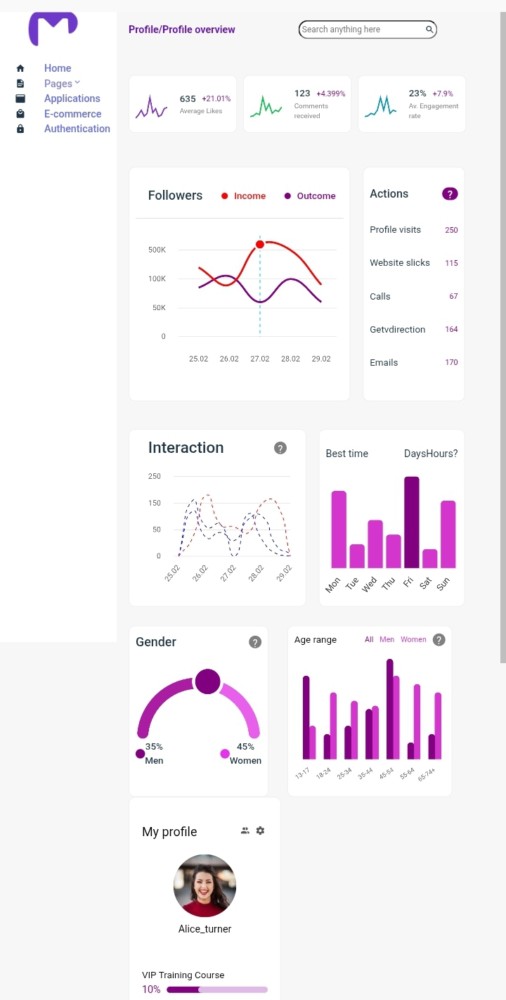
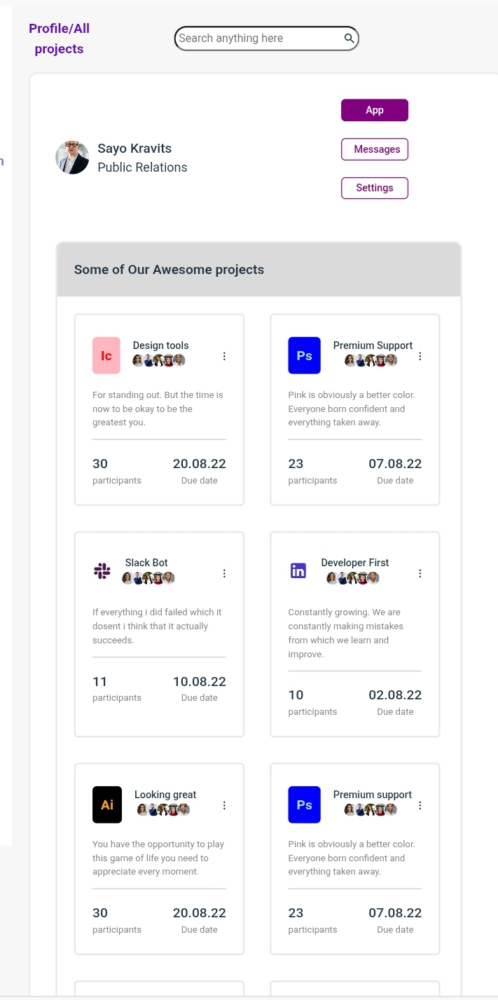
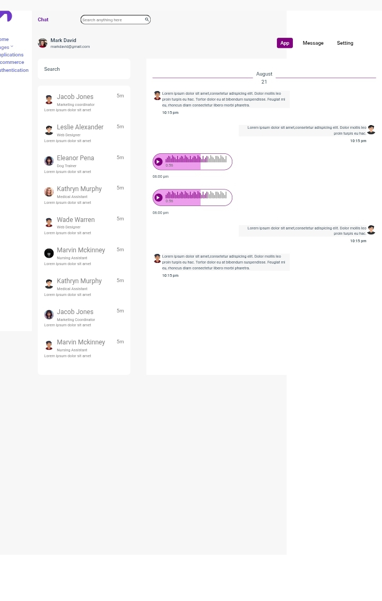
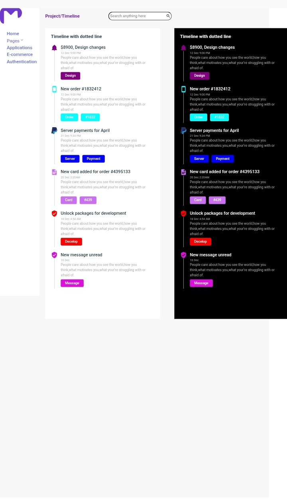

UI Dashboard

## 📸 Screenshot

## 📸 Screenshot

## 📸 Screenshot

## 📸 Screenshot

A figma design turned into code.
A responsive admin dashboard built with React and CSS, designed to provide a clean, modern, and user-friendly interface across different screen sizes.

🚀 Features

- Responsive dashboard layout
- Reusable React components
- Modern user interface
- Mobile-friendly design
- Clean and organized project structure

🛠️ Technologies Used

- React
- JavaScript (ES6+)
- CSS
- Html
- Vite

📂 Project Structure

src/
├── components/
├── assets/
├── App.jsx
├── main.jsx

🔗 Live Demo

https://mariamogunbode.github.io/ui-dashboard-project/

💻 Getting Started

Clone the repository

git clone https://github.com/mariamogunbode/ui-dashboard.git

Install dependencies

npm install

Run development server

npm run dev

🎯 Purpose

This project was built to strengthen my frontend development skills using React, component-based architecture, and responsive UI design.

👩‍💻 Author

Mariam Ogunbode

GitHub: https://github.com/mariamogunbode
